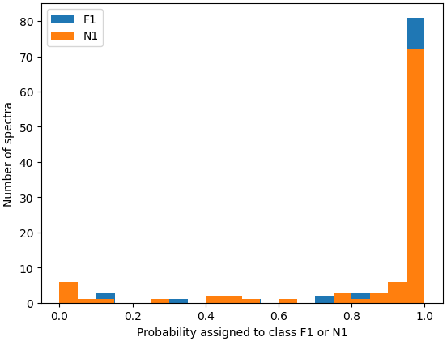

# LIBS Bone Classification using TensorFlow

<p align="center">
  
</p>

<p align="center">
<i>Figure 1. Predicted class probabilities for LIBS spectra acquired from previously unseen bone samples of individuals F1 and N1, used to evaluate model generalization.</i>
</p>

1. Motivation 

2. Project description

3. Repository structure

4. Dataset

5. Workflow

6. Neural Network

7. Results

8. Future work

# Motivation 
Laser-Induced Breakdown Spectroscopy (LIBS) produces high-dimensional spectra whose interpretation can benefit from machine learning methods. This repository illustrates a complete workflow for supervised classification of experimental spectra.

Beyond achieving high classification accuracy, the project investigates whether models trained on one bone specimen can generalize to different bones belonging to the same individual. This validation strategy, which better reflects potential forensic applications, is inspired by previous studies in the LIBS literature [1,2]. 


# Project description:  

This repository contains a simplified machine learning workflow for the classification of Laser-Induced Breakdown Spectroscopy (LIBS) spectra.

The project was developed as a proof-of-concept for applying supervised learning techniques to experimental spectroscopic data. The objective is to classify bone spectra according to the individual from which the sample originated and to evaluate the model's ability to generalize to spectra acquired from different bones belonging to the same individual.

# Repository structure

```text
.
├── notebooks/
│   └── LIBS_classification.ipynb
├── raw_data/
├── results/
├── ML_libs/
├── setup/
└── README.md
```
- **notebooks/**: main machine learning workflow.
- **raw_data/**: experimental LIBS spectra.
- **results/**: generated figures and model outputs.
- **ML_libs/**: helper functions for preprocessing and visualization.

# Dataset
Each experiment corresponds to approximately 100 LIBS spectra acquired from a single bone sample.

Each spectrum contains the measured emission intensity as a function of wavelength.

Multiple bone samples from the same individual are available, allowing the evaluation of the model's ability to generalize beyond the training specimens.

# Workflow
1. Raw spectra
2. Preprocessing
   - normalization
   - spectral region selection
   - baseline correction
3. Train/Test split
4. Random Forest baseline
5. Feedforward Neural Network (TensorFlow)
6. Generalization test using unseen bone specimens

# Neural Network 

The TensorFlow model consists of  

- Dense(128, ReLU)
- Dropout(0.5)
- Dense(64, ReLU)
- Output layer (Softmax)

Optimization:
- Adam optimizer
- Sparse categorical crossentropy
- Early stopping

# Results 
Both the Random Forest and the Feedforward Neural Network achieved high classification accuracy on the held-out test set.

The notebook also evaluates both models on spectra acquired from different bones belonging to the same individuals, providing a preliminary assessment of their ability to generalize beyond the training specimens.

# Future Work 

Future improvements include

- evaluation on a larger number of individuals and bone specimens
- hyperparameter optimization
- uncertainty estimation
- explainable AI methods (e.g. SHAP)

## References

1. Silva et al., *Spectrochimica Acta Part B*, 2014.
2. Moncayo et al., *Talanta*, 2021.
